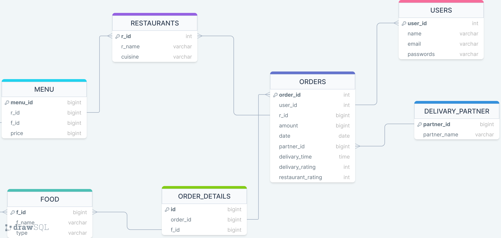

# Swiggy food delivery system

<h3>Project Overview: </h3>
The SWIGGY database is designed to manage user information, restaurant details, food items, orders, and delivery partners for a food delivery platform. It allows users to place orders from various restaurants, tracks order details, and manages delivery logistics.

<h3>Database Schema: </h3>

<ul>
  <li>USERS: Stores information about registered users, including user ID, username, email ID, and password.</li>
  <li>RESTAURANT: Contains details about different restaurants available on the platform, including restaurant ID, name, and cuisine.</li>
  <li>DELIVERY_PARTNER: Holds information about delivery partners, including partner ID and name.</li>
  <li>FOOD: Stores details about food items offered by restaurants, including food ID, name, and type.</li>
  <li>ORDERS: Manages order information, including order ID, user ID, restaurant ID, amount, order date, delivery partner ID, and ratings for delivery and restaurant.</li>
  <li>ORDER_DETAILS: Tracks the details of each item ordered in an order, including order detail ID, order ID, and food ID.</li>
  <li>MENU: Defines the menu items available at each restaurant, including menu ID, restaurant ID, food ID, and price.</li>
</ul>

<h3>SQL Queries: </h3>

<ol>
  <li>Finding customers who have never placed an order.</li>
  <li>Calculating the average price of each food item across different restaurants.</li>
  <li>Identifying the top restaurant in terms of the number of orders in a given month.</li>
  <li>Displaying restaurants with monthly revenue greater than a specified threshold.</li>
  <li>Generating monthly revenue for a specific restaurant.</li>
</ol>

<h3>Project Scope: </h3>
The project scope includes setting up the database schema, populating tables with sample data, and demonstrating SQL queries for basic operations and data analysis.

